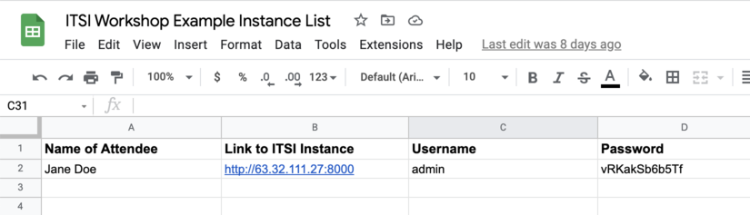
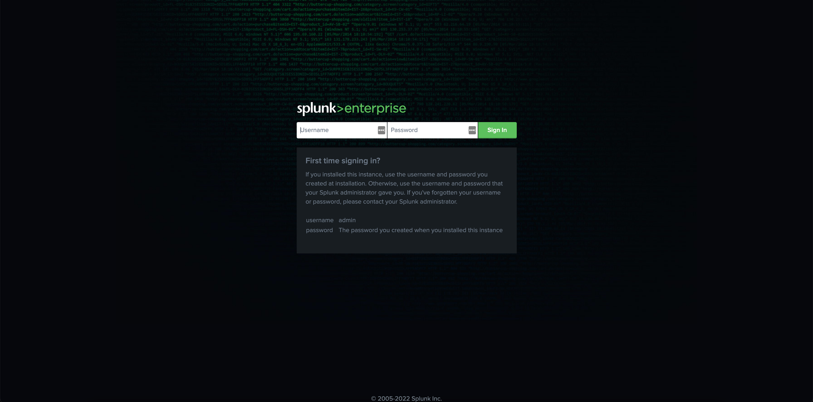
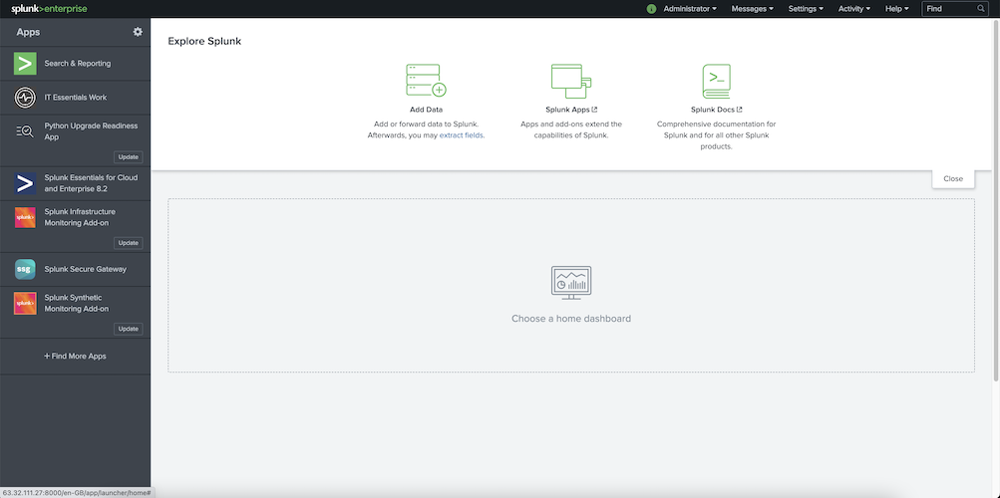
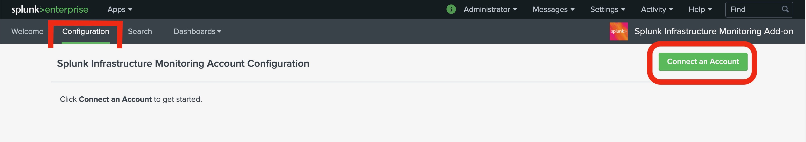
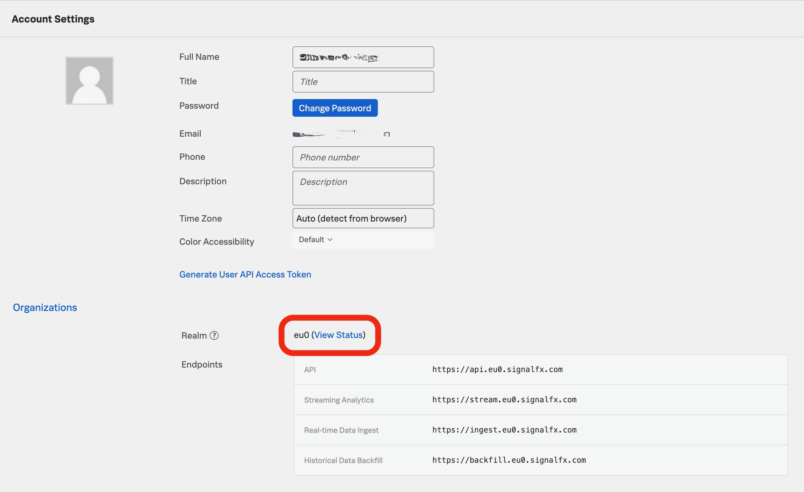
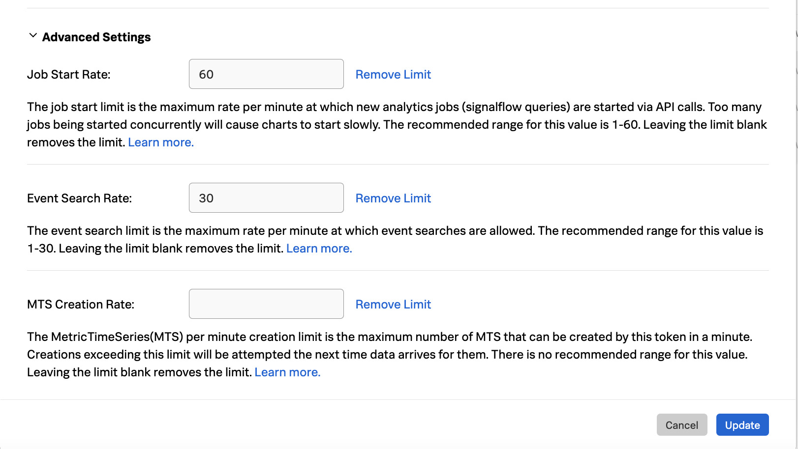
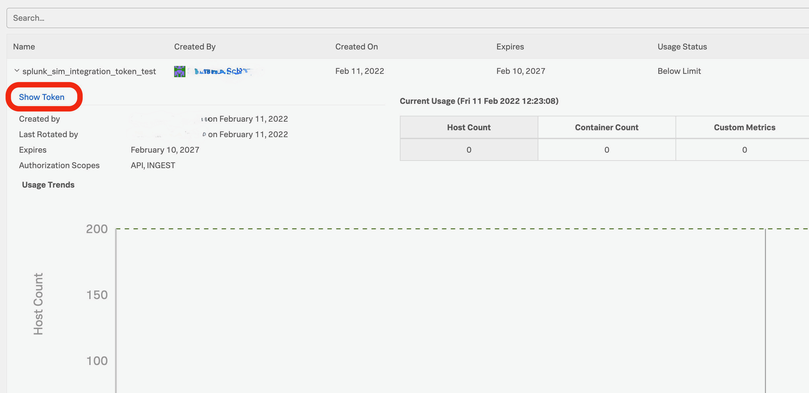

## Task 1: Login to your Splunk Instance

We deeply believe that the best way for you to familiarize yourself with the Splunk IT Service Intelligence (ITSI) Add-On is to get your hands dirty. Therefore, we provided individual sandbox environments in the form of Splunk instances for you. The first task of this workshop for you is to connect to those instances.

**A successful connection to your instance can be established via executing the following steps:**

1. Access the Instance List by clicking [**HERE**](https://docs.google.com/spreadsheets/d/1hc8tPm1xNGq_KkoPlV6BTmJbG0DJQWto_Jb1jAoKuOI/edit?usp=sharing). 
You should be able to see a Google spreadsheet that looks similar to the screenshotted example below: <br> 


2. In the first column with the title *Name of Attendee* locate your name. **Find your personal access link to the instance on the right of your name** and use it to reach the login page of Splunk Enterprise. It looks like this: <br> 

3. To log in, use the username **admin**. Use the password is provided for you in the [Instance List](https://docs.google.com/spreadsheets/d/1hc8tPm1xNGq_KkoPlV6BTmJbG0DJQWto_Jb1jAoKuOI/edit?usp=sharing). Click the *Sign In*-Button.

4. On a successful login, you might get greeted by pop-up windows showing tips, tutorials, and/or recommendations. These are not important for us right now. Feel free to ignore them by clicking the *Got it!*-Button, or respectively, the *Don't show me this again*-Button. Other than that, you should be able now to see Splunk Enterprise Home view, which initially looks like this: <br>  

If you fail to see this home view, most likely something went wrong. Please do not hesitate to raise your hand in Zoom, or shoot us a short message in the Zoom channel. An assistent will be with you shortly. 

If that is not the case, we want to congratulate you! You successfully connected to your instance, and thus completed the first task!

<br>

## Task 2: Configure the Infrastructure Add-on and the Observability Content Pack

Now that we have access to our instances, which bear the pre-installed Infrastructure Monitoring Add-On and the Observability Content Pack, we need to configure those two by follwoing the steps below.

### Task 2.1: Configuration of the Infrastructure Monitoring Add-on

*Note: For additional information, see [Configure the Splunk Infrastructure Monitoring Add-on](https://docs.splunk.com/Documentation/SIMAddon/1.2.1/Install/Configure).*

1. After you accessed your instance, navigate to the **Splunk Infrastructure Monitoring Add-On** listed on the left under **Apps**. We want to set up an account, and we can do so by navigating to the **Configuration Tab** and clicking on the '**Connect an Account**'-Button. 

<!--  -->

Once you clicked the 'Connect an Account'-Button, a dialogue appears, prompting you for the user credentials of your Observability Cloud account. These are the **Access Token** and the **Realm**, with which the Add-On can access the Oberservability Cloud. In the next steps, we are going to locate our Realm inside our individual Observability Cloud account and create a new Access Token. 

2. **Realm**: Log in to your Splunk Observability account. In the menu on the left on the bottom click on the little  icon ( respectively if the menu is expanded). On the very top of this menu, you should see your **username** right next to a profile picture. Click on it. You are now in the Account Settings, where you can find the Realm *(see screenshot below)*. 

Copy and Paste the Realm into the Input Dialogue in your IM Add-On.

3. **Access Token**: In the menu on the left in your Observability Cloud click on **Access Tokens**. Then click on the -button to create a new Access Token. In the appearing pop-up dialogue, specify a name (something like *splunk_itsi_integration_token*), and leave the *Permission* settings to default, and click *OK*. Now, your newly created Access Token should be visible in the list of available access tokens. Click on the **three little dots at the far right ent** of the token entry and select **Manage Token Limit**. Expand the **Advanced Settings** area in the appearing dialogue, edit the fields as shown in the screenshot below, and click on the **Update**-button.

After that, expand the information view of your token in the list by clicking on the little **>** on the left, and click on **Show Token**. Copy the string to your clipboard, and paste it into the Input Dialogue in your IM Add-On.


4. Once the Realm and Access Token have been inserted into the input dialogue, make sure to verify whether or not a connection to the Observability Cloud could be established by clicking on the **Check Connection**-button. If so, click submit. You can enable data collection for the account by selecting the *Data Collection* toggle.

### Task 2.2: Configure the Content Pack for Observability

2. **Configure the Content Pack for Observability**, too. You can find help in our Documentation, in this article [**HERE**](https://docs.splunk.com/Documentation/CPObservability/1.0.0/CP/Install#Install_the_Content_Pack_for_Splunk_Observability_Cloud) to be precise. Once done, you will receive this:  <span style="color:red">// Big TODO</span>.

 <span style="color:#FF5733">Please note</span>: import as disabled do no use prefix and do not use a backfill to accelerate the deployment process. 

<br>

## Task 3: Create a custom service

Open the EBS Dashboard -> open Total Ops/Reporting Interval -> view signalflow

You hould see the following :
```
A = data('VolumeReadOps', filter=filter('namespace', 'AWS/EBS') and filter('stat', 'sum'), rollup='rate', extrapolation='zero').scale(60).sum().publish(label='A')
B = data('VolumeWriteOps', filter=filter('namespace', 'AWS/EBS') and filter('stat', 'sum'), rollup='rate', extrapolation='zero').scale(60).sum().publish(label='B')
```
Let's change the signalflow to create our query in Splunk Enterprise :

```
data('VolumeReadOps', filter=filter('namespace', 'AWS/EBS') and filter('stat', 'sum'), rollup='rate', extrapolation='zero').scale(60).sum().publish(label='A');
data('VolumeWriteOps', filter=filter('namespace', 'AWS/EBS') and filter('stat', 'sum'), rollup='rate', extrapolation='zero').scale(60).sum().publish(label='B')
```
In Splunk Enterprise open Search and Reporting :

run the following command:

```
| sim flow query=data('VolumeReadOps', filter=filter('namespace', 'AWS/EBS') and filter('stat', 'sum'), rollup='rate', extrapolation='zero').scale(60).sum().publish(label='A');
data('VolumeWriteOps', filter=filter('namespace', 'AWS/EBS') and filter('stat', 'sum'), rollup='rate', extrapolation='zero').scale(60).sum().publish(label='B')
```
if you want to build a chart 

```
| sim flow query=data('VolumeReadOps', filter=filter('namespace', 'AWS/EBS') and filter('stat', 'sum'), rollup='rate', extrapolation='zero').scale(60).sum().publish(label='A');
data('VolumeWriteOps', filter=filter('namespace', 'AWS/EBS') and filter('stat', 'sum'), rollup='rate', extrapolation='zero').scale(60).sum().publish(label='B')
| timechart max(VolumeReadOps) max(VolumeWriteOps)
```

Let's create our EBS service 

Service -> new service EBS volumes

KPI new generic KPI 

past the SIM command we just created

click next 

add threshold manually

save on the bottom of the page

Let's attach our standalone to the AWS service

go to Service open AWS service

go to dependencies 

add EBS volumes

go to Service Analyzer -> Default Analyzer 

review what you built

<br>

## Task 4: Get to know Entity types

Splunk APM Entity type

Enable Modular Input for APM error rate and APM thruput

Enable APM Service 4 service to enable.

Enable Cloud Entity Search for APM 

Add a Dashboards Navigation

Add Key Vital metrics for Splunk APM.