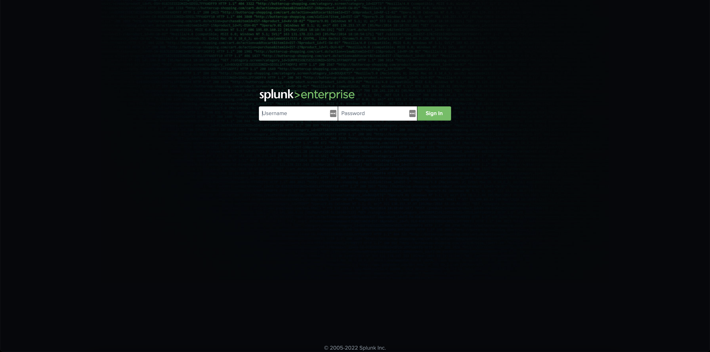

## Task 1: Login to your Splunk Instance

We deeply believe that the best way for you to familiarize yourself with the Splunk IT Service Intelligence Add-On (ITSI) is to get your hands dirty. Therefore, we provided individual sandbox environments in the form of Splunk instances for you. The first task of this workshop for you is to connect to those instances.

**A successful connection to your instance can be established via executing the following steps:**

1. Access the Instance List by clicking [**HERE**](https://docs.google.com/spreadsheets/d/1hc8tPm1xNGq_KkoPlV6BTmJbG0DJQWto_Jb1jAoKuOI/edit?usp=sharing). 
You should be able to see a Google spreadsheet that looks something like this: 

2. In the first column with the title **Name of Attendee** locate your name. Find your personal access link to the ITSI instance in the field on the right of your name
and use it to reach the login page of Splunk Enterprise. It will look like this: 

3. To log in, use the username **admin**. Use the password is provided for you in the [Instance List](https://docs.google.com/spreadsheets/d/1hc8tPm1xNGq_KkoPlV6BTmJbG0DJQWto_Jb1jAoKuOI/edit?usp=sharing). Click the **Sign In**-Button.

4. On a successful login, you might get greeted by pop-up windows showing tips, tutorials, and/or recommendations. These are not important for us right now. Feel free to ignore them by clicking the **Got it!**-Button, or respectively, the **Don't show me this again**-Button. Other than that, you should be able now to see Splunk Enterprise Home view, which initially looks like this: 

If you fail to see this home view, most likely something went wrong. Please do not hesitate to raise your hand in Zoom, or shoot us a short message in the Zoom channel. An assistent will be with you shortly. 

If that is not the case, we want to congratulate you! You successfully connected to your instance, and thus completed the first task!

<br>

## Task 2: Configure the Infrastructure Add-on and the Observability Content Pack

Configure the Infrastructure Add-on documentation can be found here 

Configure the Content Pack for Observability documentation can be found here 

Note: import as disabled do no use prefix and do not use a backfill to accelerate the deployment process. 

<br>

## Task 3: Create a custom service

Open the EBS Dashboard -> open Total Ops/Reporting Interval -> view signalflow

You hould see the following :
```
A = data('VolumeReadOps', filter=filter('namespace', 'AWS/EBS') and filter('stat', 'sum'), rollup='rate', extrapolation='zero').scale(60).sum().publish(label='A')
B = data('VolumeWriteOps', filter=filter('namespace', 'AWS/EBS') and filter('stat', 'sum'), rollup='rate', extrapolation='zero').scale(60).sum().publish(label='B')
```
Let's change the signalflow to create our query in Splunk Enterprise :

```
data('VolumeReadOps', filter=filter('namespace', 'AWS/EBS') and filter('stat', 'sum'), rollup='rate', extrapolation='zero').scale(60).sum().publish(label='A');
data('VolumeWriteOps', filter=filter('namespace', 'AWS/EBS') and filter('stat', 'sum'), rollup='rate', extrapolation='zero').scale(60).sum().publish(label='B')
```
In Splunk Enterprise open Search and Reporting :

run the following command:

```
| sim flow query=data('VolumeReadOps', filter=filter('namespace', 'AWS/EBS') and filter('stat', 'sum'), rollup='rate', extrapolation='zero').scale(60).sum().publish(label='A');
data('VolumeWriteOps', filter=filter('namespace', 'AWS/EBS') and filter('stat', 'sum'), rollup='rate', extrapolation='zero').scale(60).sum().publish(label='B')
```
if you want to build a chart 

```
| sim flow query=data('VolumeReadOps', filter=filter('namespace', 'AWS/EBS') and filter('stat', 'sum'), rollup='rate', extrapolation='zero').scale(60).sum().publish(label='A');
data('VolumeWriteOps', filter=filter('namespace', 'AWS/EBS') and filter('stat', 'sum'), rollup='rate', extrapolation='zero').scale(60).sum().publish(label='B')
| timechart max(VolumeReadOps) max(VolumeWriteOps)
```

Let's create our EBS service 

Service -> new service EBS volumes

KPI new generic KPI 

past the SIM command we just created

click next 

add threshold manually

save on the bottom of the page

Let's attach our standalone to the AWS service

go to Service open AWS service

go to dependencies 

add EBS volumes

go to Service Analyzer -> Default Analyzer 

review what you built

<br>

## Task 4: Get to know Entity types

Splunk APM Entity type

Enable Modular Input for APM error rate and APM thruput

Enable APM Service 4 service to enable.

Enable Cloud Entity Search for APM 

Add a Dashboards Navigation

Add Key Vital metrics for Splunk APM.